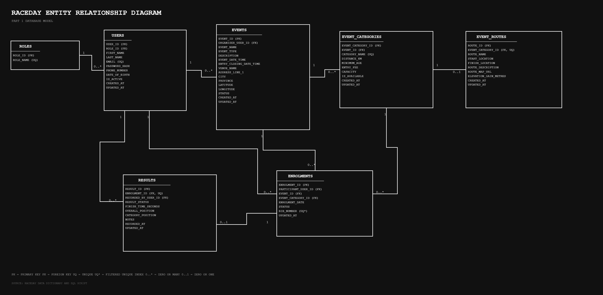
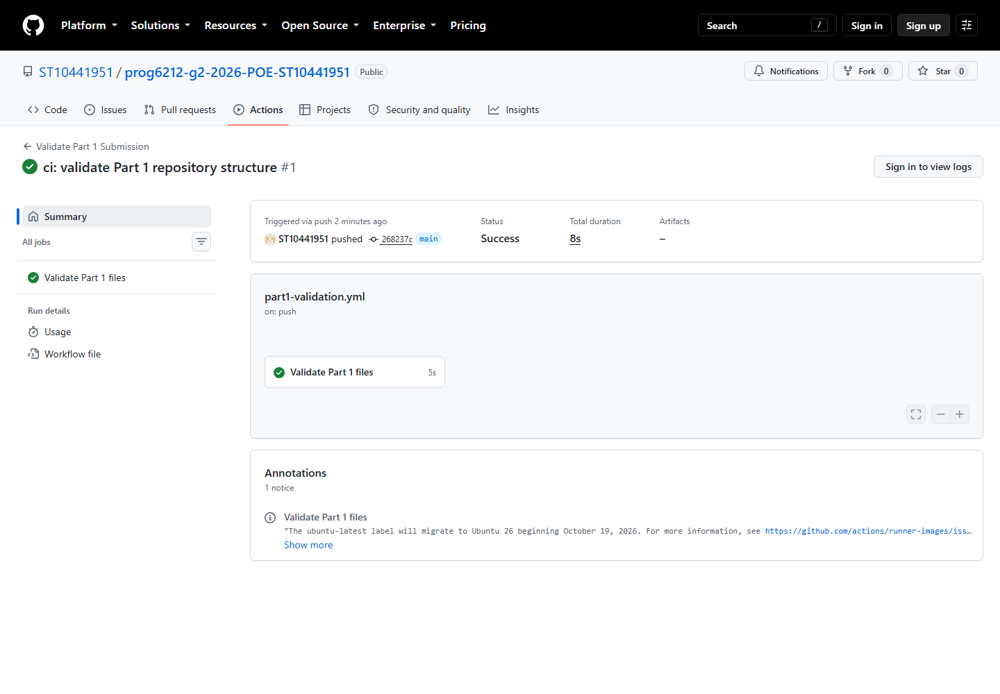

# RaceDay

[](https://github.com/ST10441951/prog6212-g2-2026-POE-ST10441951/actions/workflows/part1-validation.yml)

## Project overview

RaceDay is a planned web-based event-management system for South African road-running, walking and cycling events. It gives event Organisers a structured way to manage events, categories, routes, enrolments and results. Participants can create accounts, browse events, select categories and review their own participation history.

The project is developed progressively across three parts. Part 1 contains the system planning and SQL Server database. Part 2 will implement the REST API in C# and ASP.NET Core. Part 3 will add the MVC interface, Azure Blob Storage integration and Docker containerisation.

## Part 1 status

The main Part 1 planning and database artefacts are complete. The remaining submission work includes the final review against the Part 2 functional-requirement pages, the SSMS video demonstration, the unlisted YouTube upload and ARC submission.

No API or MVC application code is included in Part 1.

## User roles

| Role | Main responsibilities |
|---|---|
| Organiser | Creates and manages events, categories and routes; views event enrolments; allocates bib numbers; captures and corrects results. |
| Participant | Creates an account; maintains a personal profile; browses and enters events; views personal enrolments and results. |

Role and ownership checks are planned at API level. A Participant may access only their own private records, while an Organiser may manage only events assigned to them.

## Part 1 deliverables

| Deliverable | File | Status |
|---|---|---|
| Entity Relationship Diagram | [RaceDay-ERD.png](docs/RaceDay-ERD.png) | Complete |
| Editable draw.io ERD | [RaceDay-ERD.drawio](docs/RaceDay-ERD.drawio) | Complete |
| Scalable ERD export | [RaceDay-ERD.svg](docs/RaceDay-ERD.svg) | Complete |
| ERD design notes | [RaceDay-ERD-Notes.md](docs/RaceDay-ERD-Notes.md) | Complete |
| Data dictionary | [RaceDay-Data-Dictionary.md](docs/RaceDay-Data-Dictionary.md) | Complete |
| API endpoint plan | [API-Endpoint-Plan.md](docs/API-Endpoint-Plan.md) | Complete for all resources named in Part 1; Part 2 pages still require a final cross-check |
| SQL Server database script | [RaceDay.sql](docs/RaceDay.sql) | Complete and tested on a clean SQL Server LocalDB instance |
| Requirements and business rules | [Requirements-and-Business-Rules.md](docs/Requirements-and-Business-Rules.md) | Complete |
| Requirements traceability | [Requirements-Traceability.md](docs/Requirements-Traceability.md) | In progress until final submission checks are complete |
| Part 1 checklist | [Part-1-Requirements-Checklist.md](docs/Part-1-Requirements-Checklist.md) | In progress until final submission |
| Video walkthrough plan | [Video-Presentation-Plan.md](docs/Video-Presentation-Plan.md) | Complete; recording and upload still required |

## Data model



The relational model contains seven entities:

1. `Roles`
2. `Users`
3. `Events`
4. `EventCategories`
5. `EventRoutes`
6. `Enrolments`
7. `Results`

Enrolments resolve the relationship between Participants and Events while recording the selected category. Each enrolment may have no more than one official result. Foreign keys use `NO ACTION` deletion behaviour to protect historical event, enrolment and result records.

The ERD was prepared as an editable draw.io diagram and exported as PNG and SVG files for submission and review (JGraph Ltd, 2026).

## Database contents

The SQL Server script creates the full schema, constraints, supporting indexes and realistic fictional sample data.

| Entity | Seed records |
|---|---:|
| Roles | 2 |
| Users | 4 |
| Events | 3 |
| Event categories | 6 |
| Event routes | 6 |
| Enrolments | 4 |
| Results | 2 |

The four seed accounts use the local demonstration password `RaceDayDemo!2026`. These accounts and credentials are for development and assessment demonstration only. They must not be used in a deployed system.

## Opening the project

GitHub documents `git clone` as the command for creating a complete local copy of a repository (GitHub, 2026b).

```text
git clone https://github.com/ST10441951/prog6212-g2-2026-POE-ST10441951.git
```

After cloning:

1. Open `RaceDay.sln` in Visual Studio.
2. Use the `docs` folder to review the Part 1 planning artefacts.
3. Open `docs/RaceDay.sql` in SQL Server Management Studio when testing the database.

The solution does not contain a C# project yet because application implementation begins in Part 2.

## Running the database script in SSMS

Microsoft explains that SSMS can connect to a SQL Server instance, execute T-SQL and display query results (Microsoft, 2026a).

Requirements:

- SQL Server or SQL Server LocalDB.
- SQL Server Management Studio.
- Permission to create the `RaceDay` database.

Steps:

1. Open SQL Server Management Studio and connect to the intended SQL Server instance.
2. Open [RaceDay.sql](docs/RaceDay.sql) in a new query window.
3. Confirm that the instance does not already contain RaceDay tables that must be preserved.
4. Select Execute or press `F5`.
5. Confirm that the Messages area reports successful schema and sample-data creation.
6. Confirm that the final result grid displays counts for all seven entities.
7. Refresh Object Explorer and inspect the `RaceDay` database, tables, keys and relationships.

The script deliberately stops if RaceDay tables already exist. This protects existing data from being overwritten. Use a clean database for the assessment demonstration.

## Repository structure

```text
RaceDay/
|-- .github/
|   `-- workflows/
|       `-- part1-validation.yml
|-- docs/
|   |-- evidence/
|   |   `-- github-actions-success.png
|   |-- API-Endpoint-Plan.md
|   |-- Part-1-Requirements-Checklist.md
|   |-- RaceDay-Data-Dictionary.md
|   |-- RaceDay-ERD.drawio
|   |-- RaceDay-ERD-Notes.md
|   |-- RaceDay-ERD.png
|   |-- RaceDay-ERD.svg
|   |-- RaceDay.sql
|   |-- Requirements-and-Business-Rules.md
|   |-- Requirements-Traceability.md
|   `-- Video-Presentation-Plan.md
|-- RaceDay.sln
`-- README.md
```

## Continuous integration

The GitHub Actions workflow validates the Part 1 repository whenever work is pushed to `main`. It checks the required planning files, ERD formats, API endpoint coverage, SQL schema and seed sections, role descriptions, commit count and writing conventions.



The successful workflow run can also be viewed on the [GitHub Actions run page](https://github.com/ST10441951/prog6212-g2-2026-POE-ST10441951/actions/runs/35463445716).

## Video presentation

The [video presentation plan](docs/Video-Presentation-Plan.md) contains the suggested recording order, speaking prompts and SSMS demonstration steps.

The unlisted YouTube walkthrough link will be added here after the final recording has been completed and checked.

## References

Fielding, R., Nottingham, M. and Reschke, J. (2022) *HTTP Semantics*. RFC 9110. Available at: https://www.rfc-editor.org/rfc/rfc9110.html (Accessed: 19 September 2026).

GitHub (2026a) 'actions/checkout', *GitHub*. Available at: https://github.com/actions/checkout (Accessed: 19 September 2026).

GitHub (2026b) 'Getting changes from a remote repository', *GitHub Docs*. Available at: https://docs.github.com/en/get-started/using-git/getting-changes-from-a-remote-repository (Accessed: 19 September 2026).

GitHub (2026c) 'Workflow syntax for GitHub Actions', *GitHub Docs*. Available at: https://docs.github.com/en/actions/reference/workflows-and-actions/workflow-syntax (Accessed: 19 September 2026).

JGraph Ltd (2026) *draw.io*. Available at: https://www.drawio.com/ (Accessed: 20 September 2026).

Microsoft (2026a) 'Connect and query SQL Server using SQL Server Management Studio', *Microsoft Learn*. Available at: https://learn.microsoft.com/en-us/ssms/quickstarts/ssms-connect-query-sql-server (Accessed: 19 September 2026).

Microsoft (2026b) 'Controller action return types in ASP.NET Core web API', *Microsoft Learn*. Available at: https://learn.microsoft.com/en-us/aspnet/core/web-api/action-return-types?view=aspnetcore-8.0 (Accessed: 19 September 2026).

Microsoft (2026c) 'Create database (Transact-SQL)', *Microsoft Learn*. Available at: https://learn.microsoft.com/sql/t-sql/statements/create-database-transact-sql?view=sql-server-ver16 (Accessed: 19 September 2026).

Microsoft (2026d) 'Create filtered indexes', *Microsoft Learn*. Available at: https://learn.microsoft.com/en-us/sql/relational-databases/indexes/create-filtered-indexes?view=sql-server-ver17 (Accessed: 19 September 2026).

Microsoft (2026e) 'Data types (Transact-SQL)', *Microsoft Learn*. Available at: https://learn.microsoft.com/en-ca/sql/t-sql/data-types/data-types-transact-sql?view=sql-server-ver17 (Accessed: 19 September 2026).

Microsoft (2026f) 'INSERT (Transact-SQL)', *Microsoft Learn*. Available at: https://learn.microsoft.com/sql/t-sql/statements/insert-transact-sql?view=sql-server-ver16 (Accessed: 19 September 2026).

Microsoft (2026g) 'Introduction to authorization in ASP.NET Core', *Microsoft Learn*. Available at: https://learn.microsoft.com/en-us/aspnet/core/security/authorization/introduction?view=aspnetcore-8.0 (Accessed: 19 September 2026).

Microsoft (2026h) 'nchar and nvarchar (Transact-SQL)', *Microsoft Learn*. Available at: https://learn.microsoft.com/en-us/sql/t-sql/data-types/nchar-and-nvarchar-transact-sql?view=sql-server-ver17 (Accessed: 19 September 2026).

Microsoft (2026i) 'Overview of ASP.NET Core Authentication', *Microsoft Learn*. Available at: https://learn.microsoft.com/en-us/aspnet/core/security/authentication/?view=aspnetcore-10.0 (Accessed: 19 September 2026).

Microsoft (2026j) 'PasswordHasher<TUser>.HashPassword(TUser, String) Method', *Microsoft Learn*. Available at: https://learn.microsoft.com/en-us/dotnet/api/microsoft.aspnetcore.identity.passwordhasher-1.hashpassword?view=aspnetcore-10.0 (Accessed: 19 September 2026).

Microsoft (2026k) 'Primary and foreign key constraints', *Microsoft Learn*. Available at: https://learn.microsoft.com/en-us/sql/relational-databases/tables/primary-and-foreign-key-constraints?view=sql-server-ver17 (Accessed: 19 September 2026).

Microsoft (2026l) 'Unique constraints and check constraints', *Microsoft Learn*. Available at: https://learn.microsoft.com/en-us/sql/relational-databases/tables/unique-constraints-and-check-constraints?view=sql-server-ver17 (Accessed: 19 September 2026).

The Independent Institute of Education (2026) *PROG6212 Portfolio of Evidence*. Unpublished assessment brief.
